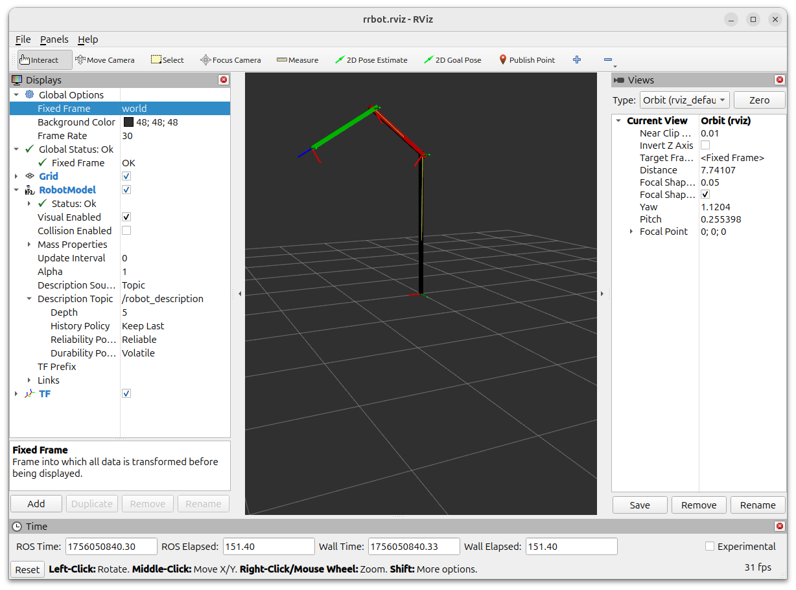
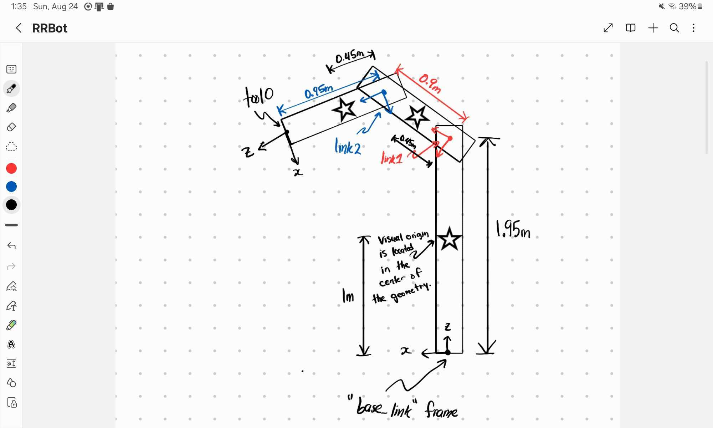
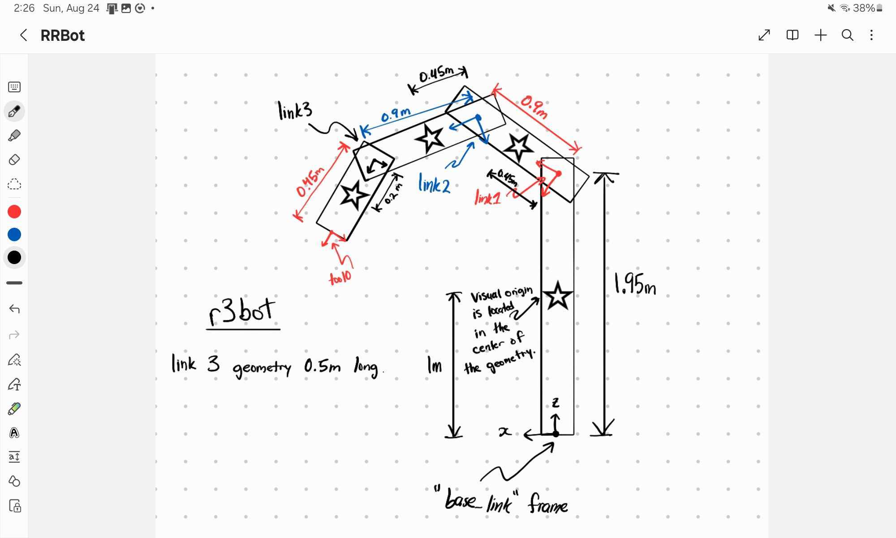
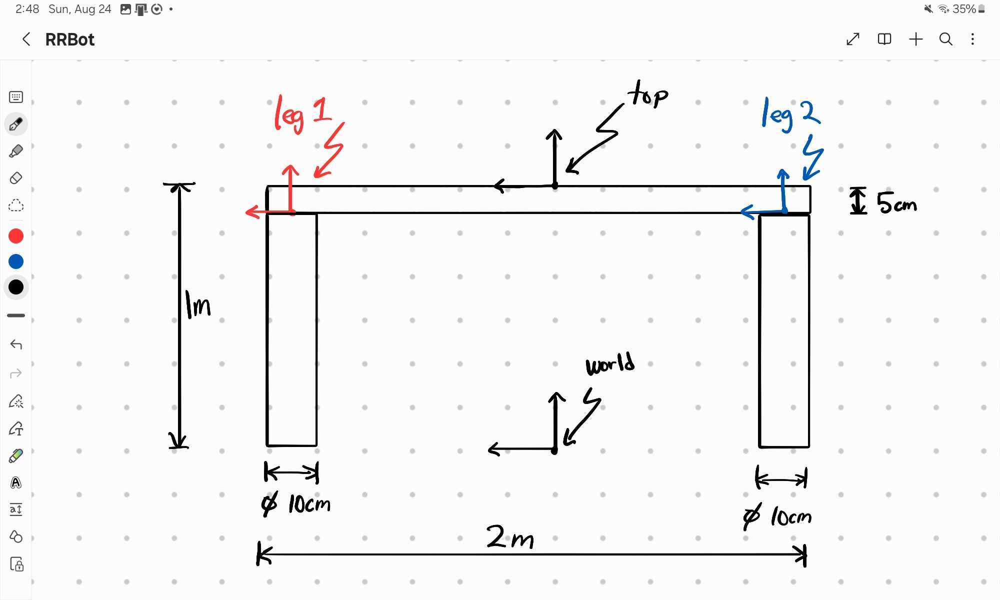

# Step 1: Introduction to URDF
This lab is focused on creating URDF (Universal Robot Description Format) files. URDF files are XML-based (Extensible Markup Language) text files which describe our robot. We can specify links and joints, and then use RViz (ROS visualizer) to move our links around. You can find the full URDF specification online [here](https://wiki.ros.org/urdf/XML).

In Step 1, you will learn how to create URDF files from scratch. In Step 2, we will use the `xacro` tool to stream-line the process. In Step 3, we will become familiar with creating a robot description as a ROS package. In Step 4, we will look at the official Universal Robotics Description Package, and get to visualize the arm moving! 

## Installing Necessary Packages

If you are not using eceprog, you will need to install the following ros packages. by following the instructions below. eceprog users do not have the required permissions to install external ros2 packages, but that is okay because the nice people in the IT department have already installed these packages for you.

Before you ever install anything on Ubuntu, make sure that you update your package manager:
```
sudo apt update
sudo apt upgrade
```

Then, you can run the installer depending on which version of ros2 you have.

Ubuntu 22.04 with ros2 humble:
```bash
sudo apt install ros-humble-joint-state-publisher
sudo apt install ros-humble-joint-state-publisher-gui
sudo apt install ros-humble-xacro
```

Ubuntu 24.04 with ros2 jazzy:
```bash
sudo apt install ros-jazzy-joint-state-publisher
sudo apt install ros-jazzy-joint-state-publisher-gui
sudo apt install ros-jazzy-xacro
```

Tip: the commands to install these ros2 packages typically follow the format `ros-{ROS-DISTRO}-package-name-with-dashes-instead-of-underscores`. This is helpful to remember when you want to install some ros2 package onto your machine, but can't find the command online anywhere.

## Running the Example
We will create a simple robot named `rrbot`, which is a robotic arm with two revolute joints. Change into the `Step1` directory and then run the command:
```bash
ros2 launch rrbot.launch.py
```
and you will see RViz open and a GUI with two sliders appear. There are some settings we need to configure in RViz.
1. In the left panel, change `Fixed Frame` from `map` to `world`.
2. In the bottom left corner above the `Time` window, click the `Add Button`. A window will appear. Scroll down and select `RobotModel`, and then press `OK`.
3. In the left panel, expand `Robot Model`. Then set the `Description Topic` to `/robot_description`. The robot should appear, and moving the sliders in the GUI should move the robot arm joints.
4. Click the `Add` Button and select `TF` and then press `OK`. Verify that moving the sliders moves the frames along with the robot.
5. Press `File > Save Config` to save your `rrbot.rviz` settings file. Next time you run the launch script, you won't need to repeat steps 1-4.

Below is an example of what your RViz window should look like. Pay special attention to the left sidebar. If you are having trouble visualizing the robot, ensure that your left sidebar exactly matches the image displayed here.



_Note: if you are using eceprog, your RViz window might appear to be flashing. This is a graphical issue caused by the ThinLinc remote desktop client. Try making the RViz window smaller (drag the upper left corner of the RViz window towards the middle) and/or putting the ThinLinc client window onto a different monitor._

## RRBot Construction

A drawing of the RRBot is shown below. The robot has 3 arms, connected by two revolute joints. The `base_link` has a length of 2 meters, while `link1` and `link2` are 1 meter in length. The joints are located 5 cm from the end of each link. There is an end-effector link called `tool0` which is attached to the end of `link2`.



Notice the "tree-like" structure of the robot: the `tool0` frame is positioned relative to its parent `link2`, which is positioned relative to its parent `link1`, which is positioned relative to the `base_link`. The position and orientation of a link is defined relative to its parent link. Looking closely, you see that `link1` is positioned 1.95 meters above the `base_link` frame. More technically, `link1` has a position of (0, 0, 1.95) in the `base_link` frame. Similarly, `link2` has a position of (0, 0, 0.9) in the `link1` frame.

In a URDF file, the `<link>` tags are used to create named links, while the `<joint>` tags are used to define the relative position and orientation of a child link relative to its parent, in addition to how the child link moves relative to its parent. These two types of tags create the structure of your robot alone. **When creating a new robot, you should start by creating the links and joints, and viewing the TFs in RViz.** The following code shows how `joint1` defines the parent/child relationship between the `base_link` and `link1` links, as well as the position of the child link relative to the parent.

```xml
<link name="base_link">
    <!-- more code will go here ... -->
</link>

<joint name="joint1" type="continuous">
    <parent link="base_link" />
    <child link="link1" />
    <origin rpy="0 0 0" xyz="0 0.05 1.95" />
    <axis xyz="0 1 0" />
</joint>

<link name="link1">
    <!-- more code will go here ... -->
</link>
```

The `<visual>` tag is responsible for adding a visual representation of the link, but does not provide any structure of the robot (the structure is defined with the `<link>` and `<joint>` tags alone). For example, take a look at the `<visual>` tag for the `base_link`:
```xml
<link name="base_link">
    <visual>
        <origin rpy="0 0 0" xyz="0 0 1.0" />
        <geometry>
            <box size="0.05 0.05 2" />
        </geometry>
        <material name="black" />
    </visual>
</link>
```
This `<visual>` tag adds a black box measuring `5cm x 5cm x 2m`. The center of the box is drawn 1 meter above the `base_link` frame (`xyz="0 0 1.0"`) so that the `base_link` frame touches the bottom of the visual box. The `<origin>` tag specifies where the center of the visual geometry appears relative to the link's origin, while the `<geometry>` tag specifies the type of geometry, and its size. Because the `<visual>` tag is purely aesthetic and has nothing to do with the actual structure of the robot, you can have as many `<visual>` tags for a particular link as you would like, which can be useful for visualizing more complicated geometries. In the drawing above, the stars depict the position of the location of the visual origin relative to the link's frame. 

Links typically also have an `<inertia>` tag, and at least one `<collision>` tag. The `<inertia>` tag is only required when simulating the dynamics of the robot (using a simulator such as Gazebo or Drake) and the `<collision>` tags are also useful for simulations. These tags will not be used in this tutorial, but they function very similarly to a `<visual>` tag.

## URDF File Structure
Open the `rrbot.urdf` file. This file describes the visual properties of the rrbot. The file starts with a XML declaration and then a robot tag.
```xml
<?xml version="1.0"?>
<robot name="rrbot">
    <!-- all of the robot code goes here -->
</robot>
```
Since the `rrbot.urdf` file is our "main" URDF flie (it's our only URDF file), we need to add the `name` attribute to the `<robot>` tag.

*Tip: you can view the `.urdf` files with text coloring in VSCode by configuring the file association for `.urdf` files. Open a `.urdf` file. In the bottom right corner of VSCode, there is a blue banner. Click on `Plain Text`, then `Configure File Association for .urdf`, and then select `XML`.*

Next, we declare some materials, which are just a convenient way to add color to our robot:
```xml
<material name="black">
    <color rgba="0.0 0.0 0.0 1.0" />
</material>
<material name="red">
    <color rgba="0.8 0.0 0.0 1.0" />
</material>
<material name="green">
    <color rgba="0.0 0.8 0.0 1.0" />
</material>
```
The colors are specified with their red, green, blue, and alpha (transparency) colors, each represented as a float between 0 and 1, inclusive.

It is common practice to define a world link which represents the global coordinate system. In our case, the `world` link and the `base_link` link will coincide.
```xml
<link name="world" />
```

Next, we define the `base_link` and give it a black visual geometry, as you have already seen above.
```xml
<link name="base_link">
    <visual>
        <origin rpy="0 0 0" xyz="0 0 1.0" />
        <geometry>
            <box size="0.05 0.05 2" />
        </geometry>
        <material name="black" />
    </visual>
</link>
```

_Note: as per the [official URDF documentation](https://wiki.ros.org/urdf/XML/link) there are only four types of geometry tags: box, sphere, cylinder, and mesh. Read the documentation for more info._

Joints are used to attach links together and define their range of motion relative to each other. Because we want to bolt the `base_link` to the `world`, we used a `fixed` joint:
```xml
<joint name="base_joint" type="fixed">
    <origin rpy="0 0 0" xyz="0 0 0" />
    <parent link="world" />
    <child link="base_link" />
</joint>
```
The order of the links and joints in the URDF file does not matter. For clarity, the joints are placed between the parent and child `<link>` tags in the URDF file.

*Note: the `rpy` values stand for roll, pitch, and yaw, which describe the rotation of the child relative to the parent about different axes. For this tutorial, we will just have `rpy="0 0 0"`.*

Next we define Link 1, and make its visual geometry a red box measuring `5cm x 5cm x 1m`. The visual origin is positioned 45 cm from the link 1 frame in the z direction.
```xml
<link name="link1">
    <visual>
        <origin rpy="0 0 0" xyz="0 0 0.45" />
        <geometry>
            <box size="0.05 0.05 1" />
        </geometry>
        <material name="red" />
    </visual>
</link>
```

All links pivot about an axis passing through the joint's origin. The `<axis>` tag specifies the axis which the child link will rotate about. Take a look at RViz again and verify that `link1` is rotating about its y-axis (green).
```xml
<joint name="joint1" type="continuous">
    <parent link="base_link" />
    <child link="link1" />
    <origin rpy="0 0 0" xyz="0 0.05 1.95" />
    <axis xyz="0 1 0" />
</joint>
```

Link 2 and joint 2 are defined similarly to link 1 and joint 1. At the end, we have a `tool0` frame. This is the location of the "end effector" (sometimes abbreviated to EE) of the robot. A tool such as a gripper or drill or marker could be attached to this point.
```xml
<joint name="tool_joint" type="fixed">
    <origin rpy="0 0 0" xyz="0 0 0.95" />
    <parent link="link2" />
    <child link="tool0" />
</joint>

<link name="tool0" />
```

## Launch Script
Now open `rrbot.launch.py`. We see three nodes are created:
* `/joint_state_publisher_gui`
* `/robot_state_publisher`
* `/rviz2`

You can verify this by running the launch script (always use `ros2 launch` to launch a launch script) and in a separate terminal type `ros2 node list`. The `/robot_state_publisher` node is responsible for taking in the URDF file and joint information and outputting the position and orientation of the robot frames. The `/joint_state_publisher_gui` provides a GUI (graphical user interface) with sliders to allow us to change the joint positions, which are sent over the `/joint_states` topic. In fact, we could publish our own message to the `/joint_states` topic to move to the robot ourselves. We will come back to this idea later.

_Note: you might see a fourth node starting with `transform_listener_impl_` that is created when rviz2 is opened. This is normal._

---

## Task 1
The goal of Task 1 is to create a new robot called r3bot (three revolute joints). This just adds a third link which is 0.5 meters in length. A drawing of the r3bot is shown below.


* To get started, copy your `rrbot.launch.py` and `rrbot.urdf` and `rrbot.rviz` files into `r3bot.launch.py` and `r3bot.urdf` and `r3bot.rviz`.
* Modify your r3bot launch script to reference the new `r3bot` files. Launch the script to verify you can see the original rrbot.
* Visit [the URDF joint specification](https://wiki.ros.org/urdf/XML/joint) to learn about revolute joints. Change the `joint1` and `joint2` to type `revolute` with a range of `[-1.57, 1.57]` radians. *Hint: you will need to change the `type` to `revolute`, and then add `lower` and `upper` attributes to the `<limit>` tag to set the joint's range. Don't forget to also include `effort` and `velocity` attributes, or you will get an error message.* Visualize the robot in Rviz to verify the limits are respected in the joint state publisher gui.
* Add a `link3` and `joint3` to your r3bot. Ensure `joint3` is a revolute joint with upper and lower limits of `+/- 1.57` radians. Change the color of link 3 to `blue`. Modify the `tool0_joint` so it is on the end of `link3`. 
* Take a screenshot of your robot with the TFs visible. Set all limits their maximum value. Ensure your screenshot contains the entire window, so the TA can verify this screenshot took place on your machine.

---

## Task 2

Using your knowledge of the URDF format, create a 4-legged rectangular table in `table.urdf` with the following requirements:
 * Table Top (box): `2m length, 1m width, 5cm thickness`
 * Table Legs ([cylinder](https://wiki.ros.org/urdf/XML/link)): `5cm radius, 95cm length`
 * The table top should be placed on top of the legs so that the surface of the table top is `1m` above the ground.
 * The origin of the table top should be centered **on top of the table**. That is, when you look at RViz, you should see that the `top` link is sitting on top of the table. This will be important for future steps, where we begin to mount a robotic arm onto the top surface of the table. (We don't want to attach the robotic arm to the center of mass of the table top.) Please see the figure below for an illustration of where the `top` frame should be placed.
 * The origin of the legs should be centered **on the top of each leg**.
 * All joints should be `fixed` type.
 * The table legs should be completely under the table top.
 * Make the table top `brown`, and the legs `light_grey`. You will need to define your own material colors.
 ```xml
 <material name="brown">
     <color rgba="0.54 0.27 0.07 1.0"/>
 </material>
 <material name="light_grey">
     <color rgba="0.8 0.8 0.8 1.0"/>
 </material>
 ```
 * Create a launch script (`table.launch.py`) to view your table. You may omit the `/joint_state_publisher_gui` node since all of the joints are fixed.

Here is a drawing of the table, for reference. Make sure link names and locations are consistent with the drawing.


It is recommended that you first create the 6 links (`world`, `top`, `leg1`, `leg2`, `leg3`, and `leg4`). Then, add fixed joints to position these links appropriately. The legs should be children of the table top. That is, `top` will have four child links: `leg1`, `leg2`, `leg3`, and `leg4`.

Take a screenshot of the RViz window when you are complete. Ensure the bottom of the legs are touching the "world" grid in Rviz.

---

## Free Response Questions

There are additional free-response questions for this problem. See the Overleaf template.

## Push to GitHub

Push your work from the step to GitHub.

## Next Steps
Proceed to [Step 2](/Step2)
